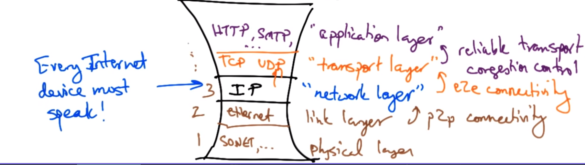

# Note For Nick Feamster's Course

## The Architectual Design Principles

阅读材料: 

[The design philosophy of the darpa internet protocols — Dave Clark 1988](https://dl.acm.org/doi/pdf/10.1145/52324.52336)

> The **top level goal** for the DARPA Internet Architecture was to develop an **effective** technique for **multiplexed utilization** of existing interconnected networks. Some elaboration is appropriate to make clear the meaning of that goal.

### 目标
#### 最基本的目标: 互联, 共享资源

##### 采用的技术

###### 分组交换

1. 为了多路复用而采用的技术
2. 流量转发所需的信息包含在了包的**destination address** 
3. 电路交换和分组交换的比较:分组交换**共享资源能力更好**
![[报文交换,电路交换和分组交换#分组交换 vs 电路交换]]
4. 有些应用, 比如说远程登陆天然的就被分组交换支持;

###### gateway 网关

分组通信处理器, 用来实现网络间的互连.

互联网的基本模型: 一种使用网关作为分组通信处理器的, 将许多可区分的网络连接在一起耳的基本设施，网关实现一种存储和前向分组转发算法

###### Narrow Waist窄腰

目标: 连接许多已经存在的网络, 对上层应用隐藏底层技术.

ip层(网络层)是网络协议栈里最窄的一层,  网络层之上可之下都可以有多种应用, 但每一个互联网设备都要实现ip协议.

**
###### NAT and IPv6

问题: IPv4 只有32位, 也就是说最多只有$2^{32}$个地址, 这很容易耗完. 

- NAT: Network Address Translation 
- IPv6: 

#### Survivability 生存能力
- 目标: 即使有一些网络设备宕机了, 网络也可以继续正常工作
两种方法:
	- replication
			有些网络将设备状态存储在中间节点上, 许多节点保有端设备的状态, 这样就必须要保证即使有一些设备坏了仍然有它的代替品存在; 这种方法很难实现
	- fate sharing  命运共享原则
> From 王廷: fate sharing不是个技术问题，而是一种设计理念（engineering design philosophy）。字面意思就是命运共享。计算机网络中的通信实体都会存储其每个通信对话的状态信息（最初的时候，早期的网络架构会将这些状态信息会分布存储在中间的网络节点上，这种方式存在很多的同步问题和可靠性问题），这样通信实体通过交换状态信息就能判断该通信联系是否正常，而且即便中间网络节点（如交换机、路由器）出现了问题，也不会影响通信实体的网络服务（还可以走其他备用路径）。fate sharing还体现在：一个通信实体以及其通信相关的状态信息可以接受同时失效（通信实体断连了，其状态信息也就没啥意义了）。
将所有必要的状态放在**通信端点**, 这些状态用于维护一个互动的通信互连.

举个栗子: 假如一个路由器崩溃了, 该路由器的所有状态(比如说路由表)就丢失了; 设备的状态信息和设备本身强相关

fate sharing相较replication的好处就是: 
1. 能够处理任意数量的中间节点错误
2. 更容易实现

#### Heterogeneity异质性
实现方法: 
1. TCP/IP网络栈, TCP提供流量控制和可靠传输, ip提供通用的转发方法
并不是所有的应用都需要TCP这么可靠的传输, 比如DNS就不需要, Narrow Waist的设计是的传输层可以被更换
2. Best effort: 使得实现简单, 但是难debug

#### Distributed Management 分布式管理

#### 
