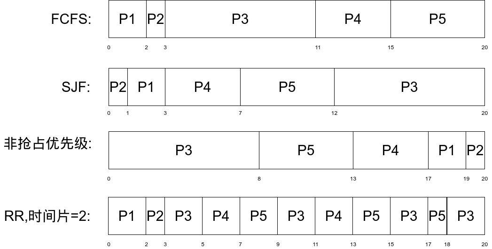
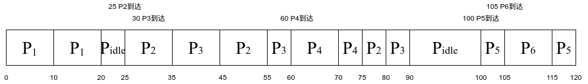

# *Arrangement 06*

> illustrate how a binary semaphore can be used to implement mutual exclusion among n processes.

互斥锁仅需要描述一个资源当前是否被占用, 无需描述有几个进程正在等待使用该资源, 因此使用,一个*binary semaphore*即可, 1表示资源未被占用, 0表示资源已被占用

> 下面是两个并发执行的进程,它们能正确执行吗?若不能.请举例说明,并修改之.

```c
int x;
// Process P1:
void fp1(){
    int y,z;
    x = 1;  // 语句A
    y = 0;
    if (x>=1)
        y = y+1;
    z = y;
}

// Process P2:
void fp2(){
    int t,u;
    x = 0; // 语句B
    t = 0;
    if (x<=1)
        t = t+2;
    u = t;
}
```

不能, 理由:
语句A和语句B的执行顺序未知, 对于fp1而言, 语句A执行完之后x的预期值为1;然而如果语句B在语句A之后运行,  x的值将为1, 对于fp1而言, 语义发生了变化, y = y + 1将不会执行.

正确代码:
```c
#define false 0
#define true  1
typedef bool int
bool available = true;
void acquire(){
    while(available == false) ;
    available = false;
}
void release(){
    available = true;
}
int x;
// Process P1:
void fp1(){
    int y,z;
    acquire();
    x = 1;  // 语句A
    release();
    y = 0;
    if (x>=1)
        y = y+1;
    z = y;
}

// Process P2:
void fp2(){
    int t,u;
    acquire();
    x = 0; // 语句B
    release();
    t = 0;
    if (x<=1)
        t = t+2;
    u = t;
}
```

## 5.7
### a

### b.周转时间
|进程|FCFS|SJF|非抢占优先级|RR|
|:--|:--|:--|:--|:--|:--|
|$P_1$|2|3|19|2|
|$P_2$|3|1|20|3|
|$P_3$|11|20|8|20|
|$P_4$| 15| 7| 17| 13|
|$P_5$| 20| 12| 13| 18|

### c.等待时间

|进程|FCFS|SJF|非抢占优先级|RR|
|:--|:--|:--|:--|:--|:--|
|$P_1$|0|1|17|0|
|$P_2$|2|0|19|2|
|$P_3$|3|12|0|12|
|$P_4$|11|3|13|9|
|$P_5$|15|7|8|13|

### d. 平均等待时间
|类型|时间|
|:--|:--|
|FCFS|6.2|
|SJF|4.6|
|非抢占优先级|11.4|
|RR|7.2|
SJF的平均等待时间最小

## 5.8

### a.Gantt



### b.周转时间

|进程|周转时间|
|:--|:-|
|$P_1$|20|
|$P_2$|55|
|$P_3$|60|
|$P_4$|15|
|$P_5$|20|

### c.等待时间

|进程|等待时间|
|:--|:-|
|$P_1$|0|
|$P_2$|30|
|$P_3$|35|
|$P_4$|0|
|$P_5$|10|

### d.cpu使用率

$\frac {105} {120} * 100 \%= 87.5\%$

## 5.10

B,D

## 5.11

### A

能够让该进程获得两倍的时间片, 换言之, 该进程的优先级提高了

### B

#### 优点

  1. 调整进程的优先级比较容易, 高优先级的进程可以获得更长的机时
  2. 由于是RR调度, 实现了优先进程的同时不会出现线程饥饿

#### 缺点

  1. 优先级低的程序等待时间较长

  2. 对短任务不友好, 响应慢.

### C

给优先级高的进程直接多分配些机时即可

## 5.13

如果是多级反馈队列算法可以让进程在时间片结束前放弃CPU以进入时间片更长的队列来获取更多机时.