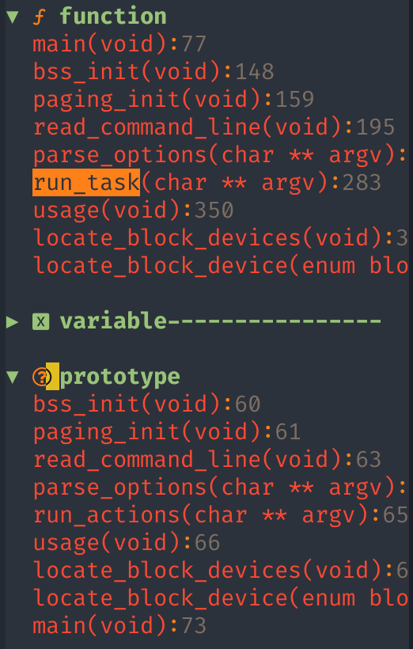
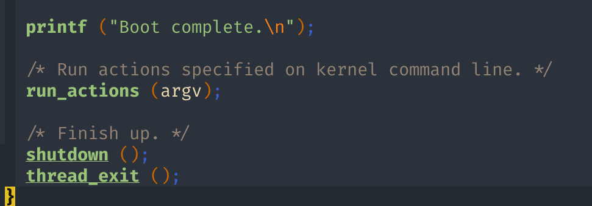
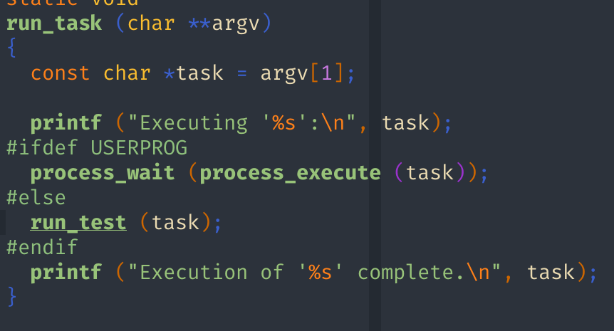
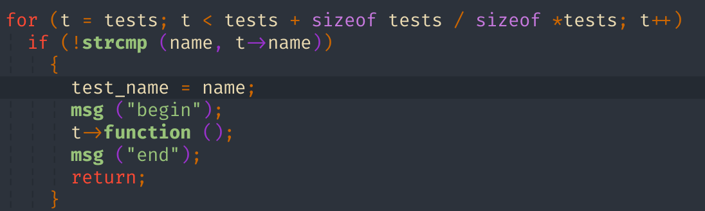
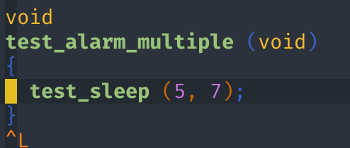
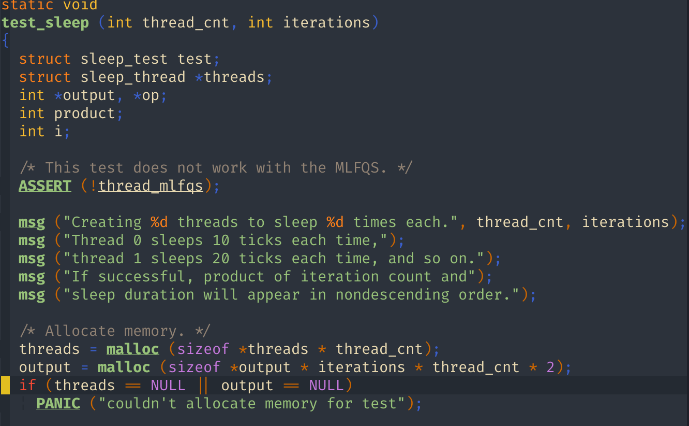
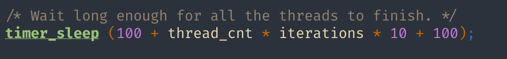
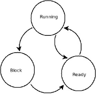
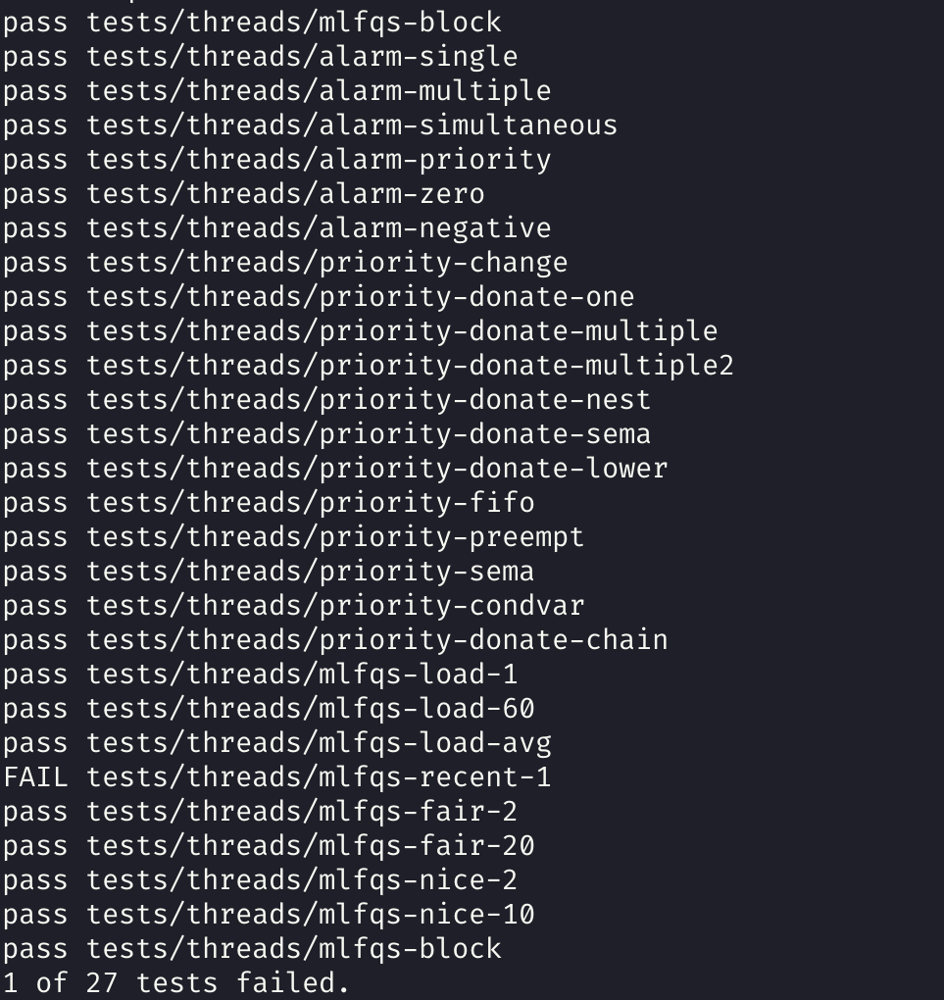

# 操作系统实践报告

课程名称: 操作系统实践				年级: 2019级 

指导教师: 杜德慧							姓名: 李俊贤

上机实践名称: project1				学号: 10195101505

---

## 一. 目的

1. 通过projcet1测试

2. 通过例程了解进程、线程的创建及主要函数的使用方法；

3. 掌握用户程序的编辑、编译、调试程序的方法；

4. 学会利用gdb跟踪程序的方法；

5. 了解Pintos工程的结构，学会Pintos的跟踪方法。

## 二. 内容与设计思想

1. 编辑几个例程，了解进程、线程的创建及主要函数的使用方法。

2. 利用gdb对上述的进程、线程的基本例程进行调试和跟踪，学会断点设置和取消方法，学会在断点处 观察变量的方法。

3. 了解Pintos工程的结构，学会Pintos的编译、运行及跟踪方法。
4. 测试驱动开发, 先把测试用例理解再针对性的写代码.

## 三. 使用环境

- Manjaro Linux x86_64

- Pintos

- vim

- gdb
- qemu
- gtag

## 四. 实验过程与分析, 调试过程

1.了解pintos系统

Pintos是80x86架构的简单操作系统框架，支持内核线程、加载和运行用户程序以及文件系统。以非常简单的方式实现了所有这些。我们将使用Bochs模拟器来查看其结果，pintos已经是一种基本的可引导操作系统。Pintos可处理中断，具有用于进程抢占的定时器中断，基本内存管理，支持普通文件系统。

 

2.了解pintos目录系统

主要的目录有：devices、examples、filesys、lib、misc、tests、threads、userprog、utils、vm

而本次需要修改的代码只要在两个目录系统中：devices和threads

 

3.了解pintos代码，了解现有忙等待存在的问题

了解pintos运行机制并且了解与project1相关的文件后，开始读project1对应的代码

找到对应的几个比较重要的文件


从main开始分析，main是样例程序的入口

main中主要的函数有下面这些



main函数调用了run_action



找到run_action函数(笔者使用gtags生成了符号文件可以直接跳转到run_action函数定义处)

仔细研究run_action函数发现有a->function (argv);且run取到对应的action为run_task，所以a->function (argv); 相当于调用run_task (argv); 


再往下发现run_task调用了run_test



当运行命令是pintos – run alarm-multiple时argv分离出来的参数: argv[0]=“run”，argv[1]=“ alarm-multiple ”

所以相当于调用run_test（alarm-multiple）



run_test所做的操作是把实参name和所有的测试样例的数组中的各个样例名称作比较，现在name的值是alarm-multiple


对比字符串相等后，t->function()会执行test_alarm_multiple函数

在alarm_wait.c中找到该函数



里面调用test_sleep函数，查找test_sleep



test_sleep函数功能：创建thread_cnt个线程，每个线程sleep迭代iterations次; 所以test_sleep（5,7）就是创建5个线程，每个线程sleep迭代7次.



休眠足够长的时间后继续运行

线程创建代码如下，看到新线程执行函数是sleeper


搜索sleeper函数


发现在alarm-wait.c文件中定义sleeper函数，其中睡眠线程使用了timer_sleep函数


发现在timer.c中的定义，其中使用了while循环判断当前线程的运行时间, 如果时间还没到的话，执行thread_yield函数，把当前线程放进ready队列.


thread_yield()中调用了list_push_back函数实现对于线程队列的改变，schedule ()函数重新调度线程。 (然而笔者手上已经没有最初版本的代码了, 就不贴了)继续搜索这两个函数

- schedule ()函数执行了以后会把当前线程放进ready队列里并调度下一个线程，即Thread_yield函数只是把线程放进调度队列，然后切换线程，此时休眠线程状态是ready. 在一个tick内该线程依然有可能会被调度，继续消耗cpu时间，没有完全把时间让给别的进程，这样不能够达到线程休眠的目的，造成了忙等待。

 

我们综上所述，之前的样例程序通过while循环，不断将线程加入队列，然后取出执行，再加入队列，取出执行。通过这样的办法实现睡眠，这就是我们说的忙等待。

这样的过程十分占用CPU，并且由于不断将线程加入队列，最后的唤醒顺序也可能混乱，因此我们需要调整这个忙等待过程，使其正常运行

### Task01: 解决忙等待问题

从产生忙等待的过程我们可以发现，前面的函数调用是没有问题的，整个问题出现是在timer_sleep函数和后面的调度算法不正确，timer_sleep函数的问题在于不应该只是把线程休眠设置成返回cpu时间并且放在ready队列中，这样的线程不能真正“休眠”，而是随时可能再被调度。

因此我们应该重新设计timer_sleep函数让休眠线程不再占用cpu时间，只在每次tick中断把时间交给操作系统时再检查睡眠时间，如果睡眠时间结束则把这个程序再放回ready队列。tick内则把cpu时间让给别的线程，可以考虑把该进程阻塞（block）。

Pintos中线程的状态实际上只有两种：就绪（Ready）和运行（Runing），由于忙等待很浪费CPU的资源，我们需要为线程增加阻塞（Blocked）的状态，来将处于忙等待的线程放到阻塞队列中来避免忙等待的产生。

同时我们要注意pintos以tick为一个时间单位，1秒有100个ticks，每个tick都会调用timer_interrupt函数。

综上我们的设计思路应该是：

1. 设置新的阻塞状态： THREAD_BLOCKED

2. 设置线程block时间 ticks_blocked

3. 执行timer_sleep 时设置ticks_blocked 时间，并将线程阻塞

4. 在每个时钟中断中执行检测函数，在检测函数中查看各个线程ticks_blocked时间，如果ticks_blocked时间未到则减去一定值，判断其是否为0来放入ready队列。



#### 原子操作分析

首先对于pintos的原子分析如下：

在阅读代码时，首先注意到里面有很多断言，还有

```c
 old_level = intr_disable ();  //start

 if (cur != idle_thread) 

  list_push_back (&ready_list, &cur->elem);

 cur->status = THREAD_READY;

 schedule ();

 intr_set_level (old_level)；  //end
```

中, old_level = intr_disable ();与intr_set_level (old_level)；起着比较关键的作用

其中，最频繁的断言是ASSERT (!intr_context ());

该断言主要表示断言这个中断不是外中断而是内中断，是操作系统正常线程切换所发生的中断

再来看old_level = intr_disable ();与intr_set_level (old_level)；

前者实现禁止中断，后者实现恢复禁止前是否允许中断的状态

这两个语句的中间语句，能确保原子性地执行，即被他俩所夹住的语句不会被中断

#### 大体思路

然后如下是对于代码的修改思路：

 实现思路： 调用timer_sleep的时候直接把线程阻塞掉，然后给线程结构体加一个成员time_to_sleep来记录这个线程要sleep多少时间， 然后利用操作系统自身的时钟中断（每个tick会执行一次）加入对线程状态的检测， 每次检测将time_to_sleep减1, 如果减到0就唤醒这个线程。

具体代码:

```c
void
timer_sleep (int64_t ticks) 
{
  if (ticks <= 0) {
    return;
  }
  /*int64_t start = timer_ticks ();*/
  enum intr_level old_level = intr_disable();
  struct thread* cur = thread_current ();
  cur->time_to_sleep = ticks;
  thread_block();
  intr_set_level(old_level);
  ASSERT (intr_get_level () == INTR_ON);
}
```

在线程被创建的时候记得初始化time_to_sleep为0， 加在thread_create函数内：(实际上之后我们在thread内添加任何成员都要记得在初始化线程的时候顺便初始化成员)

```c
  t->time_to_sleep = 0;
```

然后修改时钟中断处理函数， 加入线程sleep时间的检测， 加在timer_interrupt内：

```c
static void
timer_interrupt (struct intr_frame *args UNUSED)
{
  if(thread_mlfqs){
    thread_mlfqs_increase_recent_cpu();
    if(ticks % TIMER_FREQ == 0){
      thread_mlfqs_update_load_avg_and_recent_cpu();
    } else if(ticks % 4 == 0){
      thread_mlfqs_update_priority(thread_current());
    }
  }
  ticks++;
  thread_tick();
  thread_foreach(check_sleep, NULL);
}
```

这里的thread_foreach就是对每个线程都执行check_sleep这个函数：

```c
void check_sleep(struct thread* t, void* aux UNUSED){
        if(t->status == THREAD_BLOCKED && t->time_to_sleep > 0){
                t->time_to_sleep--;
                if(t->time_to_sleep == 0){
                        thread_unblock(t);
                }
        }
}
```

thread_unblock就是把线程丢到就绪队列里继续跑.这样timer_sleep函数唤醒机制就实现了。

### Task02: 实现优先级调度

通过分析知道线程成员本身就有一个priority, 然而pintos原来的代码并没有使用他. 为了让最高优先级的线程最先被唤醒, 我们要实现一个有序的队列, 然后每次选择队列中最大的那个线程.实际上更好的方案是实现一个大顶堆, 因为我们只需要优先级最大的那个队列, 笔者虽然没有在项目中完成堆的解决方案, 但这里仍贴出之前试写的代码.

```c
static void swap(heap_elem *, heap_elem *);

void heap_init(struct heap *h, heap_less_func cmp, bool max_heap)
{
    h->size = 0;
    h->cmp = cmp;
    h->max_heap = max_heap;
}

/* Returns the top element in the heap. */
heap_elem heap_top(struct heap *h)
{
    ASSERT(!heap_empty(h));

    return h->c[0];
}

/* Returns true if the heap is empty, false otherwise. */
bool heap_empty(struct heap *h)
{
    return h->size == 0;
}

/* Pushes the given element to the heap. */
void heap_push(struct heap *h, heap_elem e)
{
    size_t i = h->size;
    ASSERT(i < MAX_SIZE);

    h->c[i] = e;
    while (i != 0)
    {
        size_t p = (i - 1) / 2;
        if ((h->max_heap && !h->cmp(h->c[p], h->c[i])) || (!h->max_heap && !h->cmp(h->c[i], h->c[p])))
            break;
        swap(&h->c[i], &h->c[p]);
        i = p;
    }

    h->size++;
}

/* Removes and returns the top element from the heap. */
heap_elem heap_pop(struct heap *h)
{
    ASSERT(!heap_empty(h));

    h->size--;
    swap(&h->c[0], &h->c[h->size]);

    size_t i = 0;
    while (true)
    {
        size_t c = i * 2 + 1;
        if (c >= h->size)
            break;
        if (c + 1 < h->size && (h->cmp(h->c[c], h->c[c + 1]) == h->max_heap))
            c++;
        if ((h->max_heap && !h->cmp(h->c[i], h->c[c])) || (!h->max_heap && !h->cmp(h->c[c], h->c[i])))
            break;
        swap(&h->c[i], &h->c[c]);
        i = c;
    }

    return h->c[h->size];
}

static void swap(heap_elem *a, heap_elem *b)
{
    heap_elem t = *a;
    *a = *b;
    *b = t;
}
```

有堆了以后应该把`struct list ready_list`改成`struct heap ready_q`即可(然而笔者自己测试了很多次都没成功).

下面说几个关键点:

1. 高优先级线程就绪时，应抢占
   - `thread_create`中加上优先级比较决定要不要`thread_yield`即可。
2. 锁、信号量、条件变量应优先唤醒高优先级线程.
   1. 锁, 信号量, 条件变量都应该实现成优先级队列
   2.  在一个线程获取一个锁的时候， 如果拥有这个锁的线程优先级比自己低就提高它的优先级，并且如果这个锁还被别的锁锁着， 将会递归地捐赠优先级， 然后在这个线程释放掉这个锁之后恢复未捐赠逻辑下的优先级。
   3.  如果一个线程被多个线程捐赠， 维持当前优先级为捐赠优先级中的最大值（acquire和release之时）。
   4. 在对一个线程进行优先级设置的时候， 如果这个线程处于被捐赠状态， 则对original_priority进行设置， 然后如果设置的优先级大于当前优先级， 则改变当前优先级， 否则在捐赠状态取消的时候恢复original_priority。
   5.  在释放锁对一个锁优先级有改变的时候应考虑其余被捐赠优先级和当前优先级。
   6.  释放锁的时候若优先级改变则可以发生抢占。

#### 数据结构

- thread, 加下面这些

  - ```c
    int base_priority;                  /* Base priority. */
    struct list locks;                  /* Locks that the thread is holding. */
    struct lock *lock_waiting;          /* The lock that the thread is waiting for. */
    ```

- lock加这些:

  - ```c
    struct list_elem elem;      // list of who donate
    int max_priority;           // max priority among the threads acquiring the lock
    ```

- `lock_acquire` `lock_try_acquire`笔者见过一些比较有意思的实现

  - `lock_acquire` `lock_try_acquire`拆分成`lock_acquire_fail` `lock_acquire_success`
    - `lock_try_acquire`成功则调用`lock_acquire_success`，失败则直接返回
    - `lock_acquire`会先调用`lock_try_acquire`，成功则返回，失败则`lock_acquire_fail` `sema_down ` `lock_acquire_success`

- 笔者自己的实现:

  - 修改`lock_acquire`函数, `lock_release`函数, `thread_set_priority`函数
  - 新增`thread_hold_the_lock`, `thread_donate_priority`, 锁队列排序函数`lock_cmp_priority`,`thread_remove_lock`, `thread_update_priority`, ` cond_sema_cmp_priority`

  具体的实现方法就不贴了, 上交的代码里已经写了实现和详细的注释


### 实现多级反馈队列

#### 此时优先级仅由公式决定，不受其它因素影响

 `thread_set_priority` 在`thread_mlfqs`为`true`时直接`return`。

#### 实现浮点数运算

文档给的算法很详细了，但没给命名，后者难度更大一些。

如果可以用更高级的语言的话，应该把定点数封装成类，然后写运算符重载，可惜这里只有c可用。

于是只好写宏，一个微不足道的好处是新增.h文件不需要改Makefile。

### 实现优先级的更新

维护好四个值nice, load_avg, recent_cpu, priority就行了, 其中load_avg为全局变量.

#### `nice`

- 仅由`thread_set_nice`修改

#### `load_avg`

- 每`TIMER_FREQ`，先于`recent_cpu`更新

#### `recent_cpu`

- 每`tick`更新当前线程的`recent_cpu`
- 每`TIMER_FREQ`更新所有线程的`recent_cpu`，需先更新`load_avg`

#### `priority`

- 每次更新`load_avg`或`recent_cpu`后，更新`priority`

奇怪的就是笔者按照上面的逻辑维护四个值仍有一个点无法通过.

## 测试结果

