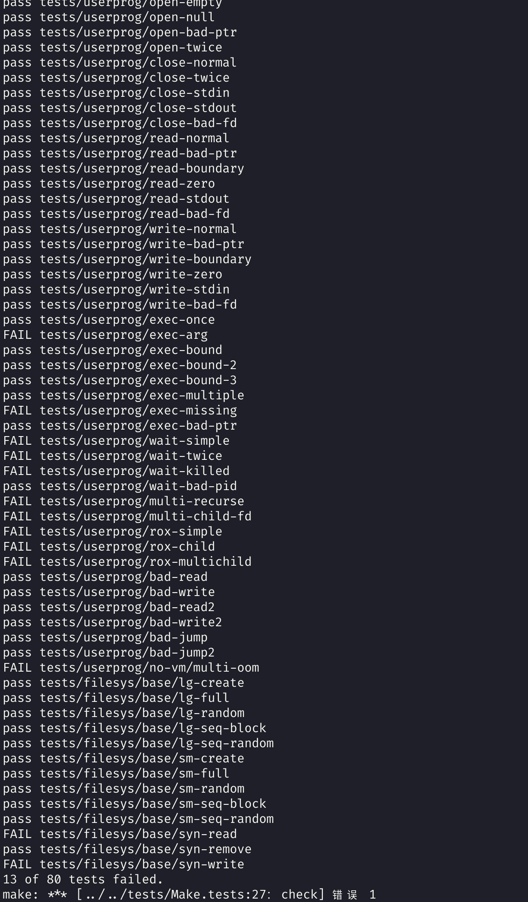

# 操作系统实践报告

课程名称: 操作系统实践				年级: 2019级 

指导教师: 杜德慧							姓名: 李俊贤

上机实践名称: project2				学号: 10195101505

---

## 一、目的

1. 了解Pintos的现有用户程序处理的功能

2. 了解Pintos提供的用户程序处理源代码

3. 完善Pintos的用户程序处理的功能

## 二、内容与设计思想

1、掌握Pintos的磁盘申请、复制等功能

2、明确Pintos的用户程序处理中存在的问题

3、具体完成以下功能

- 进程终止时输出信息

- 参数功能

- 系统调用功能

- 禁止对可执行文件的写入功能

4、撰写实验报告及项目说明

## 三、使用环境

- Manjaro Linux x86_64

- Pintos

- vim

- gdb
- qemu
- gtag

- 

## 四. 实验过程与分析, 调试过程

在之前的实验过程中我们所扮演的角色是os是修改内核的任务，而本次project2的实验是修改os来使其对用户程序服务，并测试os的用户服务的能力。

因为与project1无关，所以采用pintos源码进行修改。

本次实验总的来说需要实现两个功能：参数传递和系统调用。

问题1：父线程对子线程没等待

问题2： 参数需要分离

问题3 ： 将分离的参数压入用户栈

完成传递参数过程，并且测试得到正确的参数测试结果。

实验的具体过程：

1. 创建用户磁盘，准备用户程序

2. 代码分析，主要修改策略

### 实验准备

使用pintos-mkdisk filesys.dsk --filesys-size=2创建2m的磁盘文件系统

并用pintos -f -q将磁盘格式化

使用命令pintos -p ../../examples/echo.c -a echo -- -f -q run ‘echo x’将位于../examples/echo.c的文件复制并重命名（-a）为echo再执行

然而这里笔者的代码出现了bug.

- `Kernel PANIC at ../../threads/vaddr.h:88 in vtop(): assertion 'is_kernel_vaddr(vaddr)' failed.`
- 但origin没有问题, 排除环境问题
- 然后笔者找了很久也没有找到bug在哪里…又由于时间紧迫, 于是决定另开一个branch做project2


### 线程等待问题

开了一个新的branch以后, 上来自然是跑一手测试, 然而发现每一个测试都是还没输出就已经结束了. 按照project1的套路查看源代码. 发现project2使用process_wait()和process_execute()进行测试.阅读源代码以后发现我们需要修改以下函数:

#### `process_wait`

process_wait的函数体为空, 我们需要按照一下的逻辑写代码:

1. 等待子进程的结束, 并返回它的退出状态
2. 如果它被内核终结, 返回-1
3. 如果TID非法或者它不是caller的子进程, 或Process_wait已经成功执行, 立即返回-1, 不等待.

这需要我们修改thread的结构

加入以下字段

```c
struct list child_process_list;    /* List containing each child process. */
struct semaphore being_waited_on;  /* Used to put a parent thread to sleep when it needs to wait for a child. */
struct list_elem child_elem;       /* Used to keep track of the element in the child list. */
```

我们用锁的方法来让父进程等待子进程.具体的解释请结合代码和注释.

```c
int
process_wait (tid_t child_tid UNUSED)
{
  /* The child thread that we're waiting on to return. */
  struct thread *child_thread = NULL;

  /* list element to iterate the list of child threads. */
  struct list_elem *temp;

  /* If the list is empty, we have no children and do not need to wait. */
  if(list_empty(&thread_current()->child_process_list))
  {
    return -1;
  }
  /* Look to see if the child thread in question is our child. */
  for (temp = list_front(&thread_current()->child_process_list); temp != NULL; temp = temp->next)
  {
      struct thread *t = list_entry (temp, struct thread, child_elem);
      if (t->tid == child_tid)
      {
        child_thread = t;
        break;
      }
  }
  /* If not our child, we musn't wait. */
  if(child_thread == NULL)
  {
    return -1;
  }
  /* Remove the child from our lists of child threads, so that calling this
     function for a second time does not require additional waiting. */
  list_remove(&child_thread->child_elem);
  /* Put the current thread to sleep by waiting on the child thread whose
     PID was passed in. */
  sema_down(&child_thread->being_waited_on);

  /* After our kiddo is dead, we return its exit status. */
  return child_thread->exit_status;
}
```


#### `process_exit`

原本的process_exit已经有了大致的框架, 加上释放资源的代码即可.

#### `process_execute & start_process`

分析process_execute的功能，它大致做了以下的事情：

1. 创建了一份file_name的拷贝fn_copy

2. 创建以filename为名称的线程

3. 返回新建线程tid

4.  如果中间任何一步出错，则收回它的分页

这就产生了参数未能分离的问题，根据开头的实验，我们执行命令”echo x”，实际上调入内存的程序应当是’echo’而不是’echo x’，因此我们需要将echo与它之后的参数按照空格分离。

可以使用strtok_r函数来分离参数.

核心代码

```c
  fn_copy = palloc_get_page (0);
  if (fn_copy == NULL)
    return TID_ERROR;
  strlcpy (fn_copy, file_name, PGSIZE); /* Makes a copy of the entire command line string, args included. */

  /* Create a new string that contains soley the program name. */
  char * save_ptr;
  char * name = strtok_r((char *)file_name, " ", &save_ptr);

  /* Ensure that we weren't passed a NULL command line string (all spaces, for examples). */
  if (name == NULL)
  {
    return -1;
  }

  /* Create a new thread to execute FILE_NAME. */
  tid = thread_create (name, PRI_DEFAULT, start_process, fn_copy);
```

这里完成了一次参数分离, 到后面参数传递的时候无非就是分离->压栈的逻辑罢了.

### 参数传递

- 我将参数传递放在`start_process`中实现，在这个函数中按照x86体系标准处理好`intr_frame`的esp即可实现参数传递。这个函数最后会模拟一个中断，在`intr_frame`中进行的处理就可以得以体现了。
- 栈的布局在pintos的文档里已经说的很详细了, 就不再重复了, 见pintos的3.5.1节
- esp需要作为多种不同类型参与运算，且实际的值相同，写成`union`比较优雅

### 用户内存访问

- 对于用户提供的指针ptr，在解引用前，必须先检查：
  - `ptr != NULL`
  - `is_user_vaddr(ptr)`
  - `pagedir_get_page(thread_current()->pagedir, ptr) != NULL`
- 任意检查不通过则中止用户进程，`exit_code`应为`-1`
- 通过该指针访问的整段内存都应检查合法性，而不只是起始位置
  - 只需要检查首尾和中间每页即可
- 有个名为`multi-oom`的测试点，巨大而充满攻击性，易耗尽资源后陷入内核错误导致不通过，我仍未通过…

### 系统调用

总共要实现13个系统实现13个同名函数，声明同lib/user/syscall.h

- 要加上static
- syscall_handler利用函数指针的方式转发中断处理, 保存返回值(若有)
  - 参数与返回值的传递格式约定见文档的`3.5 80x86 Calling Convention`节

#### `exit`

- `struct thread`里加入一个字段return_value保存返回值，设置当前进程的return_value后调用thread_exit

  即可

  - `exit_code`应初始为`-1`，这样就不用每次异常退出时都设一次`-1`了
  - 以及return_value这个名字我起的太烂了, 应该用exit_code之类的

#### `write`

- 若`fd == STDOUT_FILENO`，调用`putbuf`（完成这个就可以做一些基本的测试了）
- 否则调用`file_write`（在`open`之后再实现）

#### `exec`

- `pid_t pid = process_execute(cmd_line)`
- 然后并不能直接返回`pid`，加载成功与否要判断, 然而我没有判断, 也许这就是我测试仍有未通过的点的原因吧.

#### `wait`

- 一句`return process_wait(pid)`就行了

#### `halt`

- 调用`shutdown`

#### `create`

- 调用`filesys_create`

#### `remove`

- 调用`filesys_remove`

#### `open`

- 调用`filesys_open`，返回的`struct file *`需要映射成`int fd`，哈希表或者平衡树之类的实现大概比较高效，简单一点存成链表也能用

#### `filesize`

- 调用`file_length`

#### `read`

- 若`fd == STDIN_FILENO`，调用`input_getc`
- 否则调用`file_read`

#### `seek`

- 调用`file_seek`

#### `tell`

- 调用`file_tell`

#### `close`

- 调用`file_close`，然后删除并释放对应映射
- 另外`exit`时应该把打开的文件全部`close`

### 进程终止信息

`process_exit`中以指定格式输出终止信息即可

### 实验结果

实验2整体偏难，而且相关原理在理论课中只是设计了最简单的介绍，因此在实现参数分离和系统调用的时候，在理解和实现上都遇到了很多困难，并且实验2课上安排的讲解时间只有1节课，剩下的时间都是自己做，正逢期末各种大作业和期末考试期间，所拥有的能够做实验的时间也比较少，并且由于我的两个project代码相互干扰，经常导致改到一半就使整个pintos崩溃了，所以还是一波三折的实验过程。

但是借助了较为详细的实验课ppt和github上面的很多代码，并和同学分工合作之后，还是较为顺利地完成了参数传递和系统调用。

但是project2的各项实验步骤并没有像project1一样理解得那么透彻，甚至部分代码只能copy小伙伴做的部分，无法做到很好的理解，一些偏硬件方面的实现步骤也无法做到自己不看教程能够自行完成，难度和时间问题都限制了自己能够像project1一样顺利理解和全部自行完成，但是同时在最后一节课的实验课的分享上，通过听了其他小组的同学的讲解之后对于project2其实有了更好的把握。



但是非常可惜, 我没能通过所有测试点. 究其原因一方面是时间紧迫, 同时自己没能利用好网络资源, 遇到困难钻牛角尖, 没有博取众长, 导致我做实验的效率很低. 另一方面是我的代码能力还需要提高, 在面临这种规模较大的项目时, 不能很快的将想法转化成代码, 而拖了很长时间才去实现, 导致我每次开始做实验都要重新读代码做重复工作. 

不过这只是开始, 虽然课内时间没有通过所有测试点, 我接下来有一个假期的时间继续实验, 加深对pintos的理解, 甚至继续往后做实验 .