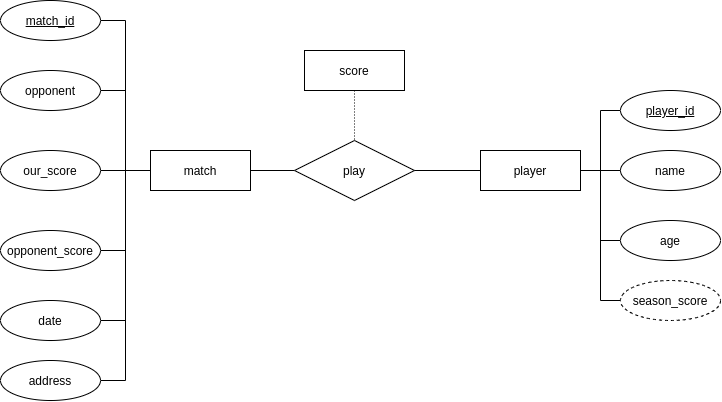
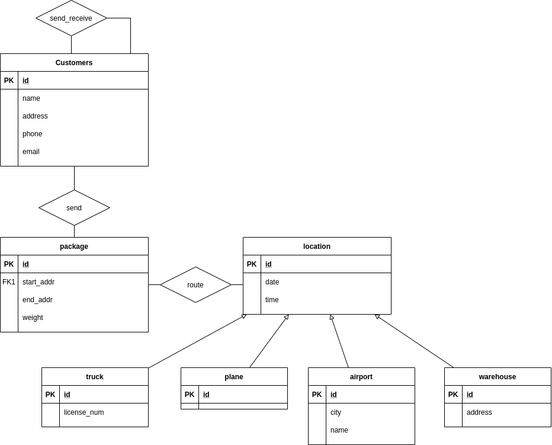

# Chapter06

## 6.3



season_score = sum of score values associated with player via play.

## 6.20 C

match(<u>match_id</u>, opponent, our_score, opponent_score, date, address)

score(<u>match_id</u>,<u>player_id</u>,value)

player(<u>player_id</u>, name, age)

## 6.23



# Chapter07

## 7.31

$AB\to CD$ is not trivial.

And $AB$ is not primary key, since :
$$
(AB\to CD,B\to D) \to (A\to C)\\
(AC\to DE, A\to C)\to (A\to DE)\\
(A\to C,A\to DE)\to (AB\to ABCDE)
$$
$G$ could not be decide by $AB$, therefore $AB$ is not primary key.

Thus, $R$ is not in BCNF.

The decomposition is$R_1=(A,B,C),R_2=(B,D),R_3=(A,B,E),R_4=(A,B,G)$.

The decomposition is not dependency preserving. For example, to check FD $DE\to B$, we have to join $R_2,R_3$.

## 7.32

### a

$$
(CD\to AB) \to (CD\to A)\\
(CD\to A, A\to BC)\to(CD\to BC)\\
(CD\to BC)\to(D\to B)
$$

$D\to B$ is nontrivial.

### b

The functional dependency in brackets is the decompose reason.
$$
R=(A,B,C,D,E,G)\\
R_1=(A,B,C),R_2=(A,D,E,G) [A\to BC]\\
R_2:R_3=(A,D,G),R_4=(D,E) [D\to E]\\
<!-- AD\to E-->
$$
The decomposition is $R_1=(A,B,C),R_2=(A,D,G),R_3=(D,E)$

### c

it is lossless.

$R_1\cap R_2 = A \to R_1$

$R_2\cap R_3=D\to R_3$

Therefore, it is lossless.

### d

It is not dependency preserving, since no schema contain $ABCD$ which is needed to check the fd $CD\to AB$

## 7.33

### a

$AB$

### b

$$
A\to DG\\
B\to CG\\
G\to DE
$$

### c

```python
for each functional dependency α → β in Fc
i := i + 1;
Ri := α β;
```

we got $R_1=(A,D,G),R_2=(B,C,G),R_3=(G,D,E)$

```python
if none of the schemas Rj , j = 1, 2, ... , i contains a candidate key for R
then
i := i + 1;
Ri := any candidate key for R;
```

$R_4=(A,B)$

### d

$R_1=(A,D,G),R_2=(B,C,G),R_3=(G,D,E),R_4=(A,B)$

## 7.34

### a

$AEGH$

### b

$$
D\to C\\
A\to D\\
DEH\to A
$$

### c


```python
for each functional dependency α → β in Fc
i := i + 1;
Ri := α β;
```

we got $R_1=(D,C),R_2=(A,D),R_3=(D,E,H, A,B)$

```python
if none of the schemas Rj , j = 1, 2, ... , i contains a candidate key for R
then
i := i + 1;
Ri := any candidate key for R;
```

$R_4=(A,E,G,H)$

Delete $R_2$

#### d

Final: $R_1=(D,C),R_2=(A,E,G,H),R_3=(D,E,H,A,B)$
